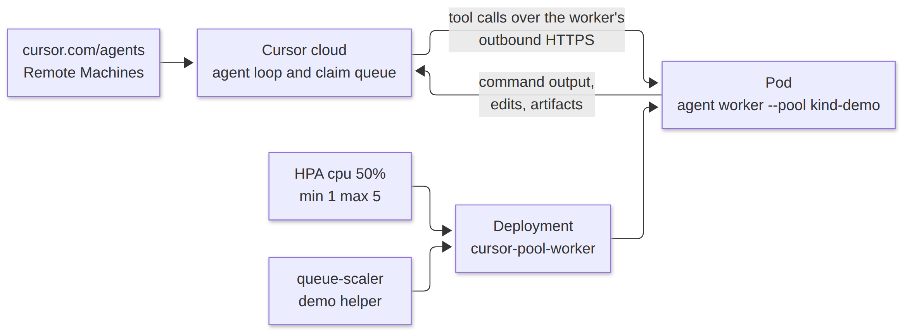
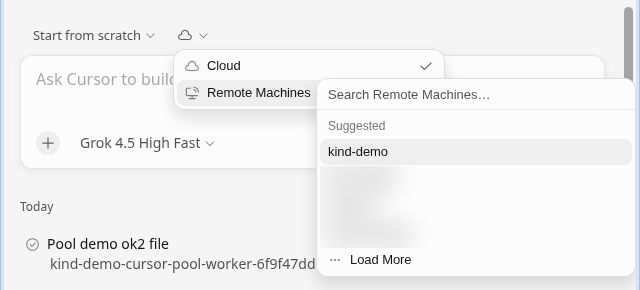
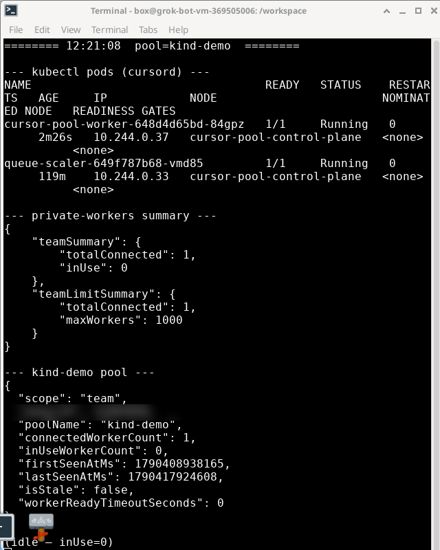
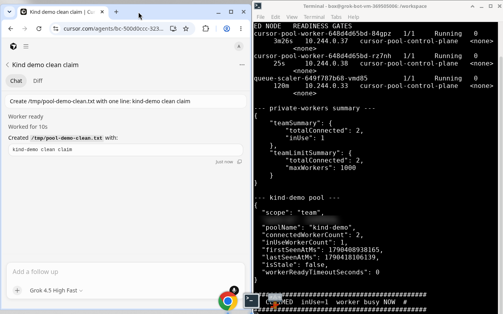

# Self-hosted Cursor workers on Kind, scaled with an HPA

This repository runs a [Cursor Team Pool](https://cursor.com/docs/cloud-agent/self-hosted/pool) on a local [Kind](https://github.com/kubernetes-sigs/kind) cluster. A long-lived worker Deployment (1 to 5 replicas) registers with pool `kind-demo`. A stock HorizontalPodAutoscaler watches CPU. An optional demo helper watches how many workers are in use.

It is a demo and proof-of-concept. For a production Kubernetes fleet, use [anysphere/k8s-workers](https://github.com/anysphere/k8s-workers): that sample runs `agent worker controller --spawn` and starts one Pod per claim, or keeps warm idle Pods with `--warm-idle`.

## Three ways to run Cloud Agents

Cursor still runs the agent loop in all three. What changes is where tool calls execute.

1. **Cursor-managed VMs.** Cursor provisions an isolated VM per agent, including snapshots, startup, artifacts, and capacity. This is the default. See [Cloud Agents](https://cursor.com/docs/cloud-agent) and [Choose where Cloud Agents run](https://cursor.com/docs/cloud-agent/self-hosted/choose-runtime).
2. **Cloud infrastructure you operate.** The same Team Pool worker can run on a platform account you own, such as Vercel, Cloudflare, or AWS Lambda. Partner guides and reference templates are on [Integrations](https://cursor.com/docs/cloud-agent/self-hosted/integrations).
3. **Self-hosted workers on your own machines or clusters.** [Self-Hosted Machines](https://cursor.com/docs/cloud-agent/self-hosted) covers My Machines and Team Pools. This repo is a small Kind version of a Team Pool: you run the pods, Cursor routes chats to the pool name.

Reference images for self-hosted workers also live in the Cursor cookbook at [`cursor/cookbook` `self-hosted-cloud-agent/`](https://github.com/cursor/cookbook/tree/main/self-hosted-cloud-agent) (`docker/Dockerfile`, `docker/entrypoint.sh`). The image in this repo is a shorter variant for the Kind demo.

## What you get here

| Piece | Role |
| --- | --- |
| `docker/` | Ubuntu 24.04 image `cursor-pool-worker:demo`. Installs the `agent` CLI and runs `agent worker --pool … start`. |
| `cluster/kind-config.yaml` | One-node Kind cluster named `cursor-pool`. |
| `manifests/deployment.yaml` | Long-lived workers. Reads `CURSOR_API_KEY` from Secret `cursor-workers-api-key`. |
| `manifests/hpa.yaml` | Stock HPA, min 1, max 5, CPU 50%. |
| `manifests/queue-scaler.yaml` | Optional **demo helper, not a Cursor product**. A third-party `alpine/k8s` container polls the private-workers API and sets replicas. |
| `scripts/up.sh` | Build, `kind load`, create the Secret, apply manifests. |

Idle workers use little CPU, so the HPA usually stays at 1 replica. The demo scaler is what reacts to load: when `inUse` is at least 1 it sets replicas to `inUse + 1` (clamped to 1–5). That is why a single claim shows two connected workers. `scripts/scale-demo.sh` pauses both scalers and walks replicas 1 → 5 → 1 by hand.

The worker image is loaded into Kind (`imagePullPolicy: Never`). It is not pushed to a registry.

## Quickstart

### Prerequisites

- Docker
- [kind](https://github.com/kubernetes-sigs/kind)
- kubectl
- A Cursor team with [Self-Hosted Machines](https://cursor.com/docs/cloud-agent/self-hosted) enabled (Allow Self-Hosted Machines, or Require Self-Hosted Machines)
- A **service-account API key**. Other API key types cannot start pool workers. Create one from [Service accounts](https://cursor.com/docs/account/enterprise/service-accounts). The key is shown once.

### Configure the key

```bash
cp .env.example .env
# set CURSOR_API_KEY in .env
```

Or pass a file you keep outside the repo (there is no default path):

```bash
mkdir -p secrets
install -m 600 /dev/null secrets/cursor-api-key.txt
# paste the key into that file, then:
export KEY_FILE="$PWD/secrets/cursor-api-key.txt"
```

`CURSOR_API_KEY` wins if both are set. `.env`, `secrets/`, and key files are gitignored.

To create the Kubernetes Secret yourself instead of letting `up.sh` do it:

```bash
kubectl -n cursord create secret generic cursor-workers-api-key \
  --from-literal=api-key="$CURSOR_API_KEY"
```

`manifests/secret.yaml.example` shows the same object. Do not commit a filled-in copy.

### Start the cluster

```bash
./scripts/up.sh
```

`up.sh` registers pool `kind-demo` (`POST /v0/private-workers/pools`), creates the Kind cluster, builds and loads the image, installs metrics-server (the HPA needs it), and applies the Deployment, Service, HPA, and demo queue-scaler. Set `SKIP_QUEUE_SCALER=1` to skip that helper.

On some Docker hosts, Kind pod egress is dropped by iptables-legacy. `up.sh` calls `scripts/fix-kind-egress.sh` after the cluster exists and, if kube-proxy is in iptables mode, switches it to nftables. Both steps are local workarounds; see [docs/architecture.md](docs/architecture.md).

### Launch an agent

1. Open [cursor.com/agents](https://cursor.com/agents).
2. Start a run (this demo's workspace starts empty, so **Start from scratch** matches the screenshots).
3. Open the machine menu, choose **Remote Machines**, then the pool name `kind-demo`.

The worker does not clone git remotes. `/workspace` inside the pod is an empty directory on the container filesystem.

### Watch the claim

```bash
./scripts/watch-claim.sh
```

The script prints pods in namespace `cursord`, the private-workers summary, and the `kind-demo` pool. When `inUse` leaves 0 it prints a `CLAIMED` banner. `KUBE_CONTEXT` defaults to `kind-cursor-pool`.

### Scale and clean up

```bash
./scripts/scale-demo.sh   # 1 → 5 → 1, then restores the HPA and queue-scaler
./scripts/down.sh         # kind delete cluster --name cursor-pool
```

## How it works

Cursor owns the claim queue and the agent loop. You own the worker Deployment and the HPA.



Source: [docs/images/architecture.mmd](docs/images/architecture.mmd).

`agent worker start` keeps a long-lived outbound connection to Cursor. The cluster does not need an Ingress, a LoadBalancer, or TLS for the worker. The ClusterIP Service on port 8080 exists so kubelet can probe `/healthz` and `/readyz`.

Each pod gets its own ephemeral `/workspace` (no PersistentVolumeClaim). `--idle-release-timeout` is 600 seconds: after a session the process stays up briefly for follow-ups, then exits 0 and Kubernetes replaces the pod.

More detail, including the ownership split and why this differs from `agent worker controller --spawn`, is in [docs/architecture.md](docs/architecture.md). Speaker notes from the live walkthrough are in [docs/talk-track.md](docs/talk-track.md).

## Screenshots

The run below was claimed by a worker pod in pool `kind-demo`. Other team pool names and the owner id in the captures are redacted.



*Agents page with Remote Machines open and pool `kind-demo` selected.*



*Before the run: one worker pod is Running, `connectedWorkerCount` is 1, and `inUse` is 0.*



*The agent run has finished. The pool shows two connected workers, `inUse` 1, and the watch script's CLAIMED banner.*

## Demo video

Coming soon. A recording of this claim flow will be added here.

## Layout

```
docker/                 worker image
cluster/kind-config.yaml
manifests/              namespace, deployment, service, HPA, demo queue-scaler
scripts/                up, watch, scale, egress workaround, down
docs/                   screenshots, architecture, talk track
tools/recording/        video-capture helpers only
```

## License

MIT. See [LICENSE](LICENSE).
